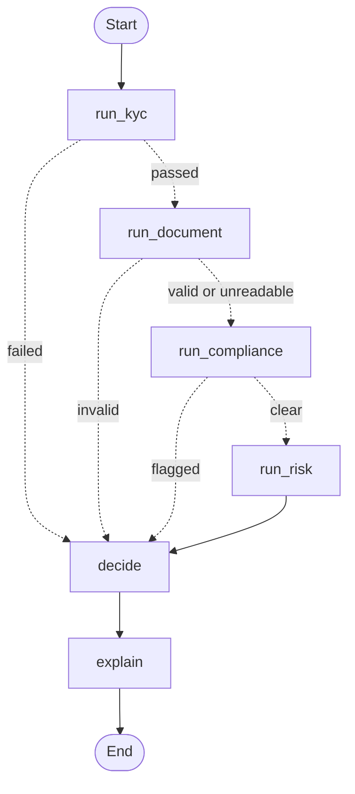

# OnBoardIQ

OnBoardIQ is an AI-powered account onboarding platform that uses a **LangChain + LangGraph multi-agent pipeline** to streamline KYC, document verification, and customer risk profiling for modern banking systems. The pipeline is modeled as a state graph with conditional short-circuit edges, and a Groq LLM (Llama 3.3 70B) generates a customer-friendly explanation of the final decision.

## Overview

The system lets users:
- register with identity details (PAN, Aadhaar, DOB, mobile, email)
- upload an ID document for verification
- get screened against global sanctions lists in real time
- receive an AI-driven onboarding decision with a risk profile
- store customer and application records in a PostgreSQL database

It is designed as a practical demo of an agentic AI workflow for account onboarding.

## Features

- Identity validation (PAN, Aadhaar, mobile, age ≥ 18)
- Real OCR-based document verification using Tesseract
- AML / sanctions screening via the public OpenSanctions API
- Rule-based customer risk profiling with transparent factors
- Orchestrator agent that combines all checks into a single decision
- Streamlit onboarding wizard + admin dashboard
- FastAPI backend with a Postgres-backed record of customers and applications

## Agents & pipeline

The pipeline lives in `backend/agents/` and is orchestrated by a **LangGraph state machine** (`orchestrator_agent.py`):



Conditional edges short-circuit to the `decide` node when any check fails, so we never waste an OpenSanctions call or Tesseract OCR pass on an applicant who has already been rejected.

| Agent | Role |
|---|---|
| `kyc_agent` | Validates PAN, Aadhaar, mobile, age, cross-checks name against records |
| `document_agent` | Runs Tesseract OCR on uploaded ID and matches name + PAN |
| `compliance_agent` | Screens the applicant against the OpenSanctions public API |
| `risk_agent` | Rule-based risk score using age, income, employment, KYC, document quality |
| `decide` node | Applies the decision waterfall over the collected agent outputs |
| `explain` node | Groq LLM (Llama 3.3 70B) generates a friendly natural-language explanation of the decision. Skipped if `GROQ_API_KEY` is missing. |

## Tech Stack

- Python 3.11
- **LangChain + LangGraph** (state-machine orchestration, conditional routing)
- **Groq** — Llama 3.3 70B (LLM that generates the decision explanation)
- FastAPI (backend API)
- Streamlit (UI)
- PostgreSQL (storage)
- Tesseract OCR (via `pytesseract`)
- OpenSanctions public API (AML screening)
- Faker (seed data)

## Project Structure

The backend follows a layered architecture — **Routes → Services → Agents → DB** — so each file has a single, well-defined responsibility.

```
backend/
├── agents/                         # LangGraph state machine + 4 specialized agents
│   ├── kyc_agent.py                #   identity validation
│   ├── document_agent.py           #   Tesseract OCR + matching
│   ├── compliance_agent.py         #   OpenSanctions AML screening
│   ├── risk_agent.py               #   rule-based risk scoring
│   └── orchestrator_agent.py       #   compiled LangGraph StateGraph
│
├── api/
│   ├── main.py                     # FastAPI app + router mounts
│   └── routes/                     # HTTP routes split by domain
│       ├── customer.py             #   /customer/*
│       ├── onboarding.py           #   /onboarding/*
│       └── admin.py                #   /admin/*
│
├── config/
│   └── settings.py                 # env vars + constants (DB, LLM, external APIs)
│
├── db/
│   ├── connection.py               # Postgres connection (reads settings)
│   ├── queries.py                  # all SQL lives here
│   └── schema.sql                  # DDL for customers, applications, documents
│
└── services/
    └── onboarding_service.py       # business logic between routes and agents

ui/
├── app.py                          # Streamlit onboarding wizard
└── pages/admin_dashboard.py        # admin view (customers + applications)

notebooks/
└── seed_customers.py               # Faker-based seed script
```

**How a request flows:**

```
Streamlit UI
   → FastAPI route (backend/api/routes/onboarding.py)
      → service function (backend/services/onboarding_service.py)
         → LangGraph orchestrator (backend/agents/orchestrator_agent.py)
            → KYC → Document → Compliance → Risk → Decide → Explain
         → DB writes (backend/db/queries.py)
      → JSON response back to UI
```

Route handlers stay thin (parse input, call service, return response). Services handle the "what actually needs to happen" logic. Agents are pure — they take a dict and return a dict.

## Getting Started

### Option A — Docker Compose (fastest)

One command spins up Postgres + backend + UI:

```bash
GROQ_API_KEY=<your key> docker compose up --build
```

- UI: [http://localhost:8501](http://localhost:8501)
- API: [http://localhost:8000](http://localhost:8000)
- API docs: [http://localhost:8000/docs](http://localhost:8000/docs)

Postgres schema is created automatically on first boot from `backend/db/schema.sql`.

### Option B — Local development

### 1. Create the environment

**Using conda (recommended — installs the Tesseract binary automatically):**

```bash
conda env create -f environment.yml
conda activate onboardiq
```

**Using pip + venv (requires Tesseract installed separately):**

```bash
python3 -m venv .venv
source .venv/bin/activate     # Windows: .venv\Scripts\activate
pip install -r requirements.txt
brew install tesseract        # macOS; use apt/choco on Linux/Windows
```

### 2. Add your Groq API key

Sign up for a free key at [console.groq.com/keys](https://console.groq.com/keys), then:

```bash
cp .env.example .env
# open .env and paste your key
```

If `GROQ_API_KEY` is missing, the pipeline still runs — it just skips the LLM and uses the rule-based fallback orchestrator.

### 3. Set up PostgreSQL

Create a database named `loan_db` locally, then create the tables:

```bash
psql -U postgres -d loan_db -f backend/db/schema.sql
```

This drops any old `users` / `loans` tables and creates `customers`, `onboarding_applications`, and `documents`. If your Postgres credentials differ from the defaults, update `backend/db/connection.py`.

### 4. Seed some fake customers (optional)

```bash
python notebooks/seed_customers.py
```

This inserts ~50 fake Indian customers using Faker so you have data to browse in the admin dashboard.

### 5. Run the backend

```bash
uvicorn backend.api.main:app --reload
```

API available at `http://127.0.0.1:8000`.

### 6. Run the frontend

In a separate terminal:

```bash
streamlit run ui/app.py
```

Open `http://localhost:8501` in your browser. The admin dashboard is at the "Admin Dashboard" page in the sidebar.

## Testing

The test suite uses `pytest` with `pytest-mock` for isolating external dependencies (DB, Tesseract, OpenSanctions, Groq).

```bash
pytest              # run all tests
pytest -v           # verbose output
pytest tests/test_orchestrator.py     # single file
```

**Coverage:**
- 8 tests on `kyc_agent` (PAN/Aadhaar/mobile format, age check, bureau matching, DB fallback)
- 11 tests on `document_agent` (regex field extraction + full verify flow with mocked OCR)
- 5 tests on `compliance_agent` (OpenSanctions match handling + network fallback)
- 5 tests on `risk_agent` (score ranges, factor reporting)
- 5 integration tests on the LangGraph orchestrator (happy path + all 3 short-circuit branches)

**Total: 34 tests, ~1.5s runtime.** All external services are mocked, so tests run offline and are safe to include in CI.

## Deployment

See [DEPLOYMENT.md](DEPLOYMENT.md) for a step-by-step guide to deploying on free-tier Neon (Postgres) + Render (backend) + Streamlit Community Cloud (UI).

## Notes

- **LangGraph pipeline**: the orchestrator is a compiled `StateGraph` with 6 nodes and 3 conditional edges. Failed checks short-circuit straight to the `decide` node, so a bad-PAN request finishes in ~10ms without touching OpenSanctions or Tesseract. The Groq LLM in the final `explain` node generates a friendly customer-facing message — if `GROQ_API_KEY` is missing, that node returns an empty string and the rest of the response is unaffected.
- **OCR** requires the Tesseract binary. Conda installs it automatically; pip users must install it via `brew install tesseract` (macOS), `apt install tesseract-ocr` (Linux), or the Windows installer.
- The **compliance agent** calls `api.opensanctions.org` — no API key needed, but it falls back to "clear" if the service is unreachable so onboarding never blocks on network errors.
- The Streamlit UI communicates with the FastAPI backend on port `8000`.
